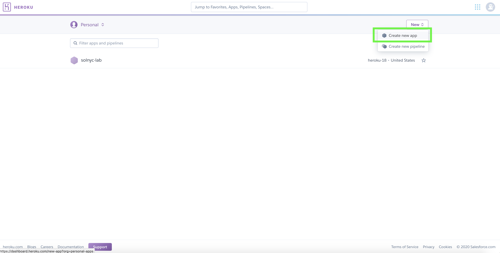
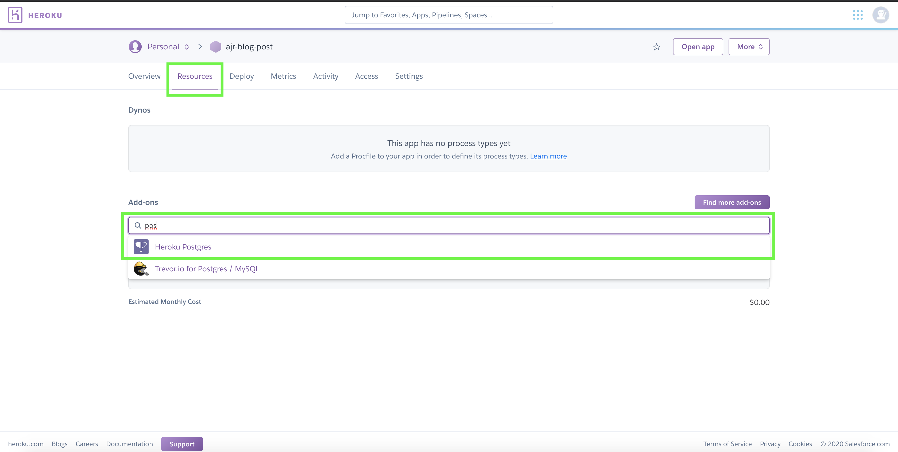
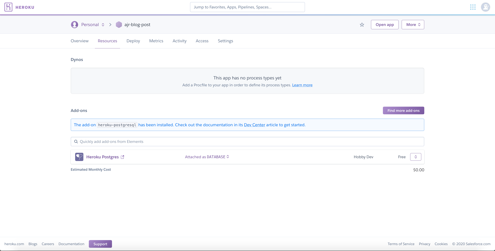
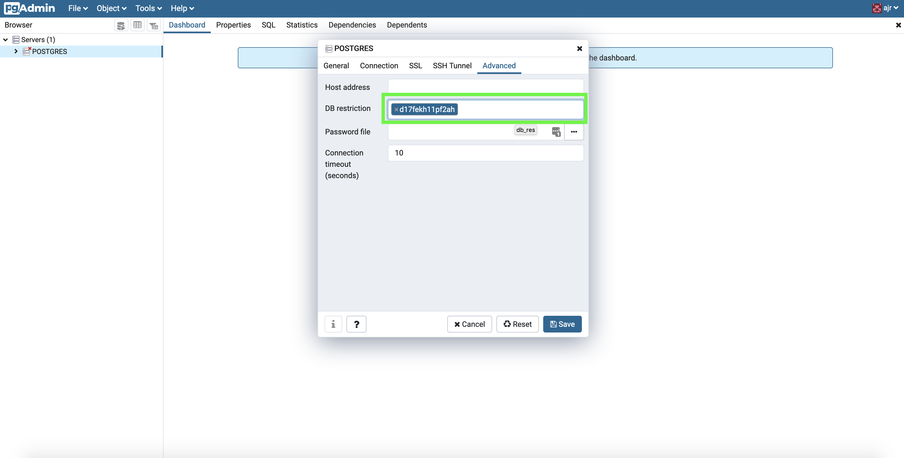
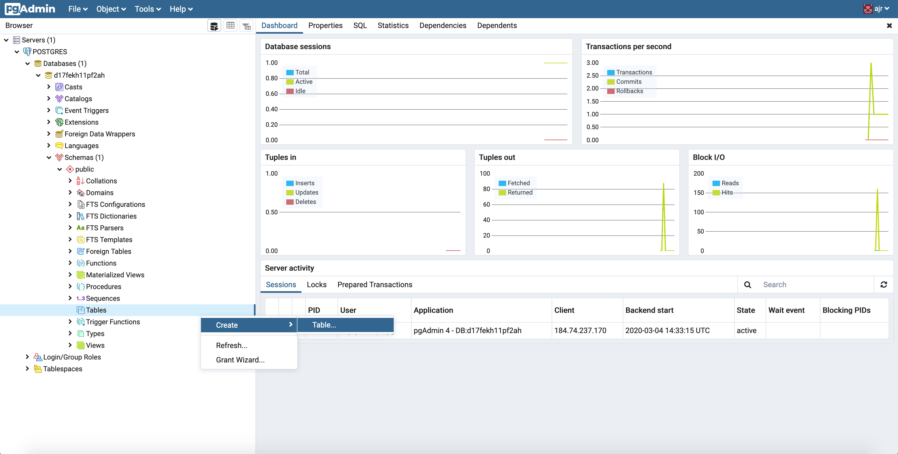
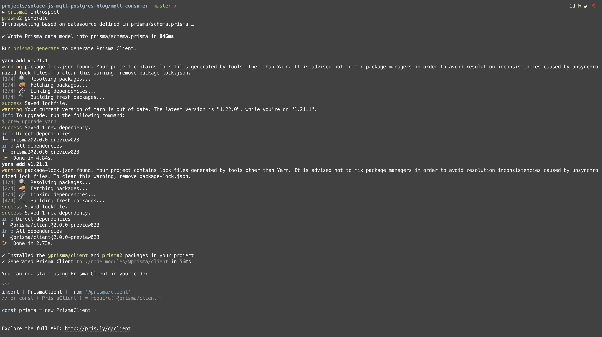

# Project Starter — Solace, JavaScript, MQTT, PostgreSQL

## Introduction

It's 2020 and starting a new project has never been easier. There are "batteries included" open source tools that solve so many categories of problems. Our job as developers is to stand on top the shoulders of the maturing IaaS, PaaS, SaaS, and Docker/K8 ecosystems and "build cool stuff". Yet ironically, developers sit down today, with the power of decades of innovation awaiting their GUI-issued commands, and don't do their one job. They don't immediately start building cool stuff 👎

Developers sit there completely overtaken by [analysis paralysis](https://en.wikipedia.org/wiki/Analysis_paralysis#Software_development) and thrash between shiny new objects until they forget they were even starting a project in the first place.

But there's a better way: aim to get started as quickly as possible and budget for a period of trial and error in the project’s timeline. This way, the decisions you make about what tools to use for the project will be founded by your own experiences. Instead of front-loading the start of a project with research heavy decision making, we should front-load our projects with broader architectural planning and give ourselves an iterative feedback mechanism for the smaller decisions. Win 👍

I'd also argue that decoupling the activity of researching technologies from the starts of projects (as much as possible) is best practice. Make researching in small intervals a part of your daily routine, keep good notes, and make a list of different tools that solve categories of problems. When you run into that category of problem, try out the tools you have lined up for it. This way, when you want to start your project, there are a list of action items waiting for you instead of a list of research assignments with unclear deliverables.

My personal strategy for beating analysis paralysis goes something like this: default to using well-vetted open source protocols, languages, and frameworks, and whenever possible, leverage free tier SaaS products that are built on top of open source technologies. When my toolbelt is full, I create an event mesh using Solace's PS+ Event Brokers and plug my tools into it. Since both the event mesh and each one of its nodes (the tools) are scalable, I can tinker around with app specific business logic happily assuming the resources underneath it aren't going to give out.

In this blog post, I’m going to walk through a tech stack that can easily be extended to meet a wide range of use cases: Solace, JavaScript, MQTT, and PostgreSQL. We'll use a basic user registration event flow to demonstrate connectivity.

**📚 Specifically, we’re going to cover how to:**

- Start a Solace Cloud Messaging Service (optional)
- Build a basic Node.js MQTT producer
- Start a free managed PostgreSQL service using Heroku
- Use pgadmin4 to administer a PostgreSQL database (optional)
- Use pgadmin4 to add a table to a PostgreSQL database
- Build a basic Node.js MQTT consumer
- Configure Prisma Client JS on our Node.js MQTT consumer to interact with our managed PostgreSQL service

**🛠️ Tools Used:**

- [Solace PubSub+ Cloud](https://console.solace.cloud/login/new-account)

  - Enterprise-grade messaging as a service, on demand in your favorite public and virtual private clouds.

- [MQTT](http://mqtt.org/)

  - MQTT is a machine-to-machine (M2M)/“Internet of Things” connectivity protocol. It was designed as an extremely lightweight publish/subscribe messaging transport.

- [MQTT.js](https://github.com/mqttjs)

  - MQTT.js is a client library for the [MQTT](http://mqtt.org/) protocol, written in JavaScript for Node.js and the browser.

- [Heroku Postgres](https://www.heroku.com/postgres)

  - Heroku offers a managed Postgres service with a generous free tier and ability to scale up effortlessly, what’s not to love?

- [pgadmin4](https://hub.docker.com/r/dpage/pgadmin4/)

  - pgAdmin 4 is a web based administration tool for the PostgreSQL database.

- [Prisma Client JS](https://github.com/prisma/prisma-client-js)
  - Prisma Client JS is an auto-generated database client that enables type-safe database access and reduces boilerplate. You can use it as an alternative to traditional ORMs such as Sequelize, TypeORM or Knex.js.

---

## Starting a Solace Cloud Messaging Service

**⏩ Feel free to skip this section if you already have access to a Solace event broker.**

There’s no better tool for beating analysis paralysis than Solace’s PubSub+ Advanced Event Broker. Open protocol support and any-to-any protocol translation built into the broker means there is absolutely no vendor lock-in with Solace.

In interest of keeping this article short ish, I’m not going to walk through the instructions for setting up a Solace Cloud Service here. Instead, follow along with the instructions here: [Creating Your First Messaging Service — 1.0 documentation](https://solace.com/cloud-learning/group_getting_started/ggs_signup.html)

## Build a Basic Node.js MQTT Producer


🔧 Resources for this section: [https://github.com/solacese/solace-js-mqtt-postgres-blog/tree/master/mqtt-producer](https://github.com/solacese/solace-js-mqtt-postgres-blog/tree/master/mqtt-producer)

JavaScript is becoming a lingua franca for newly minted programmers coming out of university programs, and the ecosystem is full of innovative libraries that solve a lot of different categories of problems. The language is becoming increasingly expressive thanks to ECMAScript and today's ESNext (whatever the latest version of the specification is), and build tools are becoming easier and easier to use thanks to Babel and bundlers like Parcel.

JavaScript paired with MQTT provides a versatile foundation for systems programming, event-driven microservices, and event-driven frontends, and more.

If you follow the link to the resources I'll be covering in this section, you'll find a skeleton to a basic JavaScript MQTT producer. At a high level, what this code does is initialize an MQTT client, connect to your Solace broker using the credentials you fill into the `.env` file, and publish a single mock user registration event on topic `User/Registration/Add`. The included MQTT client is a wrapper I wrote around [MQTT.js](https://github.com/mqttjs), a JavaScript MQTT client library.

I'm not going to cover any MQTT or messaging basics in this blog post, so if you want to learn about topics or need a refresher, follow along with our documentation here: [https://docs.solace.com/PubSub-Basics/Understanding-Topics.htm](https://docs.solace.com/PubSub-Basics/Understanding-Topics.htm).

### 🏃Steps to get started:

Before you can run this publisher you need to follow the instructions listed in the `.EDIT-ME.env` file and fill in the connection details of your messaging service found in the connect tab of your messaging service, depicted below.


Notes: 1) be sure to use the host URL under the "MQTT Host" option, 2) if you're using our software broker the URL is tcp://localhost:1883 unless you're using a non-default message VPN or have changed the MQTT service's port.

After you fill in the details and rename `.EDIT-ME.env` to `.env`, use these commands to install the required packages:

```
git clone https://github.com/solacese/solace-js-mqtt-postgres-blog.git
cd solace-js-mqtt-postgres-blog/mqtt-producer
npm i
```

And to run the code, run this command: `npm run start`

If you want to re-run the publisher, you should Ctrl-C and re-run the command.

## Start a Free Managed PostgreSQL Service Using Heroku

If you check out [database popularity rankings](https://db-engines.com/en/ranking), you'll find Postgres in the top 5. Better yet, Postgres is free, open-source, has a mature ecosystem of tooling around it, and has a great community following. If your project needs a relational database, I think Postgres is an excellent choice.

Before I learned about Heroku's free tier managed Postgres service ([here](https://www.heroku.com/postgres)), I used to pay for a micro sized RDS instance on AWS any time I needed a database for my projects. No longer! Heroku's managed service is super easy to use, includes a more than generous free tier, and is able to scale on short notice with no operational overhead if your project gains traction. This is exactly the sort of tool I aim to use in my projects.

### 🏃Steps to get started:

First, sign up for a Heroku account ([link for easy access](https://signup.heroku.com/)).

Then, once you log into your new account, create an application.



Click into your newly created Heroku application, click on the Resources tab, and start typing "Postgres" in the input depicted below so that we can add the PostgreSQL add-on to our application.



When you select the Postgres add-on, you'll be presented with a modal that allows you to select your plan type. Select the Hobby Dev free tier and then smash the provision button!


In a matter of seconds, your Postgres add-on will be provisioned.



Click into your Postgres add-on, click the Settings tab, and you'll see the option to view your Postgres service credentials. Take note of these for later use.


## Use pgadmin4 to Administer a PostgreSQL Database

**⏩ Feel free to skip this section if you prefer to interact with Postgres using a different method.**

Heroku does not have a built in GUI for administering your Postgres service. Personally, I've found using the [official pgadmin4 docker image](https://hub.docker.com/r/dpage/pgadmin4/) to be the easiest solution in this space. This section will go over how to set it up.

### 🏃Steps to get started:

Starting pgadmin4 in your browser is super easy using docker. Assuming you have access to docker on your machine, swap out the two placeholder values (<your login name> and <your password>, values can be whatever you'd like they're just your sign in to your local pgadmin4 GUI) and then run the following commands:

```
docker pull dpage/pgadmin4
docker run -d -p 5555:80 --name pgadmin -e PGADMIN_DEFAULT_EMAIL="<your login name>" -e PGADMIN_DEFAULT_PASSWORD="<your password>" dpage/pgadmin4
```

This command will pull the necessary image and then start it as a container in detached mode, meaning it'll run in the background and not require you to keep your terminal window open.

If you're able to run that command successfully, if you open your browser up to localhost:5555 you'll see:


Login using the credentials you started the container with, right click Servers, and then Create -> Server:


On the General tab, fill in a name. Then, using the credentials from your Heroku admin dashboard (depicted in the previous section), click the Connection tab and fill in: Host name, Port, Maintenence database (the database name), Username, and Password. Click save.


If you've successfully followed along to this point, you'll now be able to interact with your Postgres service 👍

But here we run into a small issue — what you'll see is something like this:


There are **675** databases showing in my GUI, and they're all the random names generated by Heroku. I think this is because its a shared service. There's no security issue here, our username and password will only work for **our** database, but it's annoying to have to Ctrl-F our database everytime we login to pgadmin. Luckily there's a work around: restrict the server to only display a single database. To accomplish this, disconnect the server:


Right click the server and click properties, click the Advanced Tab, and fill in your database name into the DB Restriction field:



Click save, and reconnect the server like so:


If successful, your GUI should now look much more reasonable:


## Use pgadmin4 to Add a Table to a PostgreSQL Database

Now that pgadmin4 is setup, let's walk through how to add a table to our database using its GUI. This should go without saying, but probably don't use the GUI for anything besides development.

Our example producer is going to send a user registration event that includes a name, email, and phone number, so we need to create a `user` table that includes these fields.

### 🏃Steps to get started:

Right click Tables, then click Create -> Table



Fill in `user` in the name field


Switch to the Columns tab and add three columns by clicking the plus button in the top right. Configure each row like you see in the picture below and then click save.


## Build a Basic Node.js MQTT Consumer

🔧 Resources for this section: [https://github.com/solacese/solace-js-mqtt-postgres-blog/tree/master/mqtt-consumer](https://github.com/solacese/solace-js-mqtt-postgres-blog/tree/master/mqtt-consumer)

Now that our publisher and database is set up, we'll set up a Node.js MQTT consumer to receive mock user registration events.

If you follow the link to the resources I'll be covering in this section, you'll find a skeleton to a basic JavaScript MQTT consumer. At a high level, what this code does is initialize an MQTT client, connect to your Solace broker using the credentials you fill into the `.env` file, and set up a topic subscription and event handler for `User/Registration/Add`. I'm not going to go in depth into it here, but check out [this repository](https://github.com/solacese/mqtt-event-handler-pattern) if you want to learn more about the event handler abstraction included in the client. In short, I think it's a succinct way to express "execute this function when this type of event is received."

You'll also notice that there is some code commented out in a few files that has to do with Prisma — we'll get to that in the next section.

### 🏃Steps to get started:

Before you can run this consumer you need to follow the instructions listed in the `.EDIT-ME.env` file and fill in the connection details of your messaging service found in the connect tab of your messaging service, depicted below.


Notes: 1) be sure to use the host URL under the "MQTT Host" option, 2) if you're using our software broker the URL is tcp://localhost:1883 unless you're using a non-default message VPN or have changed the MQTT service's port.

After you fill in the details and rename `.EDIT-ME.env` to `.env`, use these commands to install the required packages:

```
cd ../mqtt-consumer
npm i
```

And to run the code, run this command: `npm run start`

If you want to re-run the consumer, you should Ctrl-C and re-run the command.

If your consumer successfully starts up, it will listen for events on the `User/Registration/Add` topic and log to console when it receives any. In the next section, we're going to use Prisma Client JS to wire together this consumer with our Postgres database.

## Configure Prisma Client JS on the Node.js MQTT Consumer to Interact With the Managed PostgreSQL Service

We're in the home stretch!

[Prisma Client JS](https://github.com/prisma/prisma-client-js) is an auto-generated database client that enables type-safe database access and reduces boilerplate. You can use it as an alternative to traditional ORMs such as Sequelize, TypeORM or Knex.js. Prisma Client JS is part of what's going to be called the "Prisma Framework," which is going to give you a set of tools to access, migrate, and administer a variety of databases (Postgres, MySQL, MongoDb). There's been a lot of buzz around it, especially in the GraphQL community, so I wanted to give it a try. After playing around with it, in my opinion it lives up to the hype.

I recommend that you read Prisma's GitHub README top to bottom, but I'm going to speed through the steps required to get Prisma up and running in this project.

### 🏃Steps to get started:

Download Prisma's CLI using this command:

```
npm install -g prisma2
```

Then, make sure you're in the mqtt-consumer directory, and run:

```
prisma2 init
```

You should see the following output in your terminal:


At this point, navigate to `mqtt-consumer/prisma/.env` and fill in DATABASE_URL with the value you find on your Heroku dashboard:


With this environment variable filled out, you're ready to see why Prisma is being hyped up. From the mqtt-consumer directory, run the following commands:

```
prisma2 introspect
prisma2 generate
```

You should see the following output in your terminal:



... and if you look at your schema.prisma now, you'll see that it has inserted a new code block:


That's it for setup. What Prisma2 has done for you automatically is generate data models based on your database's existing tables, and then install a custom Prisma2 client package inside your node_modules (don't run `npm i @prisma/client`, the generate step does this for you) with all the methods related to CRUD operations on your objects. Pretty sweet.

Now all that's left is to uncomment the client code that takes User Registration Events and creates an item in your database using Prisma.

Here are the steps:

- Navigate to `mqtt-consumer/src/index.js` and uncomment lines 18 and 41-49; delete or comment out line 52
- Navigate to `mqtt-consumer/src/event-handlers.js` and uncomment lines 20-27

Double check to make sure your commments are correct, and then go ahead and start your consumer (`npm run start` from the mqtt-consumer directory).

From a separate terminal, start up the MQTT producer (`npm run start` from the mqtt-producer directory) and you should see:


## Conclusion

I hope you found this post useful. For more information, visit [PubSub+ for Developers](https://www.solace.dev/). If you have any questions, post them to the [Solace Developer Community](https://solace.community/).
